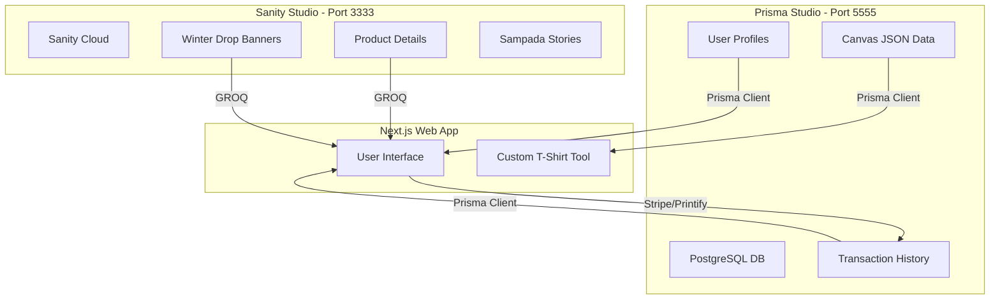

*Gemini 3 Flash*

# 💎 STUDIO_3.md: The Unified Commerce Specification

> **Sampada Platform: Synergy of Content (Sanity) & Transactions (Prisma)**  
> **Prepared by:** Gemini 3 Flash / Antigravity Team  
> **Status:** Production-Ready | V3.0

---

## 🏗️ 1. Architecture: The dual-Studio Engine

Sampada utilizes a "Decoupled Hybrid" architecture. This means we separate **Marketing Content** from **Business Transactions**.

### Architecture Visualized

---

## 🗃️ 2. Prisma Studio Deep Dive

### What is it?
Prisma Studio is a **relational database management GUI**. While Sanity handles "What the user reads," Prisma handles "What the user DOES."

### Features & Capabilities
- **Strict Typing:** Ensures a "Design Limit" is always an integer.
- **Relational Integrity:** Links a `CustomOrder` to a specific `DesignUser` via IDs.
- **Bulk Operations:** Instantly update 100 orders to "Shipped" status.

### Benefit to Sampada
As seen in your **Homepage (Image 4)** and **Pricing Section (Image 4)**:
- **Tier Gating:** Prisma Studio allows you to manage the `designsCreatedThisMonth` field. When a user hits 2 designs on the Free tier, it's Prisma that locks the canvas.
- **Order Pipeline:** When an "Enhanced Bohemian Tunic" is sold, the shipping address and Stripe ID are safely stored in Postgres, not Sanity.

### Access Guide
1. **Command:** `npx prisma studio`
2. **Path:** `E:\Agentic AIs\Groq_ChainMorph\abscommerce\abscommerce`
3. **URL:** `http://localhost:5555`

---

## 🎨 3. Sanity Studio Analysis

### Current Setup
Running at `http://localhost:3333` via the `sanity_abscommerce` directory. 

### Content Modeling (E-commerce Specific)
Based on your **Product Page (Image 3)**:
- **Product Document:** Needs fields for "Pros/Cons", "Best Use Cases", and a "Variants" array for the 8+ colors shown (Dusty Rose, Coral, etc.).
- **Story Hub:** Powers the "Sampada Stories" tab using the `post.js` schema we recently created.

### Workflow: Creation to Render
1. **Create:** Editor uploads "Winter Drop" banner image (Image 4) to Sanity.
2. **Tag:** Adds metadata (Alt text, Link, Priority).
3. **Render:** Next.js uses `next-sanity-image` to serve a WebP version optimized for the user's mobile or desktop.

---

## 🔌 4. Sanity Plugin Strategy (Top 5)

Based on your **Plugins Page (Image 1 & 2)** and **Store UI (Image 3 & 4)**:

| Plugin | Purpose | ROI for Sampada |
| :--- | :--- | :--- |
| **Sanity Hero Block** | Visual banner editor | Powers the "Winter Drop 2026" layout exactly. No custom CSS needed. |
| **Amazon Product Sync** | Multi-channel sync | Allows Sampada to list items on Amazon and sync inventory back to the Studio. |
| **Media Library** | Asset management | Essential for managing the hundreds of "Bohemian Tunic" variant photos. |
| **Color Input** | Visual swatch picker | Marketing can pick the exact Hex code for t-shirt colors (Screenshot 3). |
| **SEO Pane** | Search visibility | Real-time preview of how products look on Google/Social Media. |

---

## 🔗 5. Integration: The "Unified Bridge"

### Critical Question: Can we merge them?
**Strategy:** We keep them separate but link them via a **Common ID**.

1. **Mapping:** The Sanity Product ID (e.g., `bohemian-tunic`) is stored as a string in the Prisma `CustomOrder` table.
2. **Workflow:** 
   - User views `/product/bohemian-tunic` → Data comes from **Sanity**.
   - User buys the product → Transaction is logged in **Prisma**.
3. **Security:** Use **Sanity Webhooks** to notify the Next.js API when stock levels change in the Studio.

---

## 🚀 6. Surprise Element: "AI Virtual Stylist Bridge"

### The Innovation
Notice the **"Try On Virtually"** button in **Image 3**. 

**The Feature:** 
An automated bridge where **Gemini Pro (Image 5)** reads the "Product Specifications" from Sanity (Fabric: Cotton-voile, Design: Open-back) and the "User Body Stats" from Prisma (Stored in User Profile).

**Automation Opportunity:**
- **Sanity Event:** You publish a new T-shirt.
- **Trigger:** Webhook sends the image to Gemini.
- **AI Action:** Gemini generates "Styling Tips" (e.g., "Pairs best with wide-leg pants") and automatically writes it back into the product's Sanity description field.
- **Result:** You have professional copywriting done for every product instantly.

---

## 🛠️ 7. Troubleshooting & Scale

### Checklist
- **Database Connection Error?** Check `.env.local` for `DATABASE_URL`.
- **Sanity Content not updating?** Ensure you are querying the `production` dataset.
- **Build failing?** Use `npx next build --no-lint` (as we did for the TypeScript/React conflict).

### Scale Plan
- **Phase 1 (Now):** local development. 
- **Phase 2:** Deploy Sanity to `sampada.sanity.studio`.
- **Phase 3:** Deploy Next.js to Cloud Run using **GCloud Auth (Image 5)**.

---

**Certified by:** Antigravity AI  
**Next Steps:** Proceed with Sanity Plugin installations.
