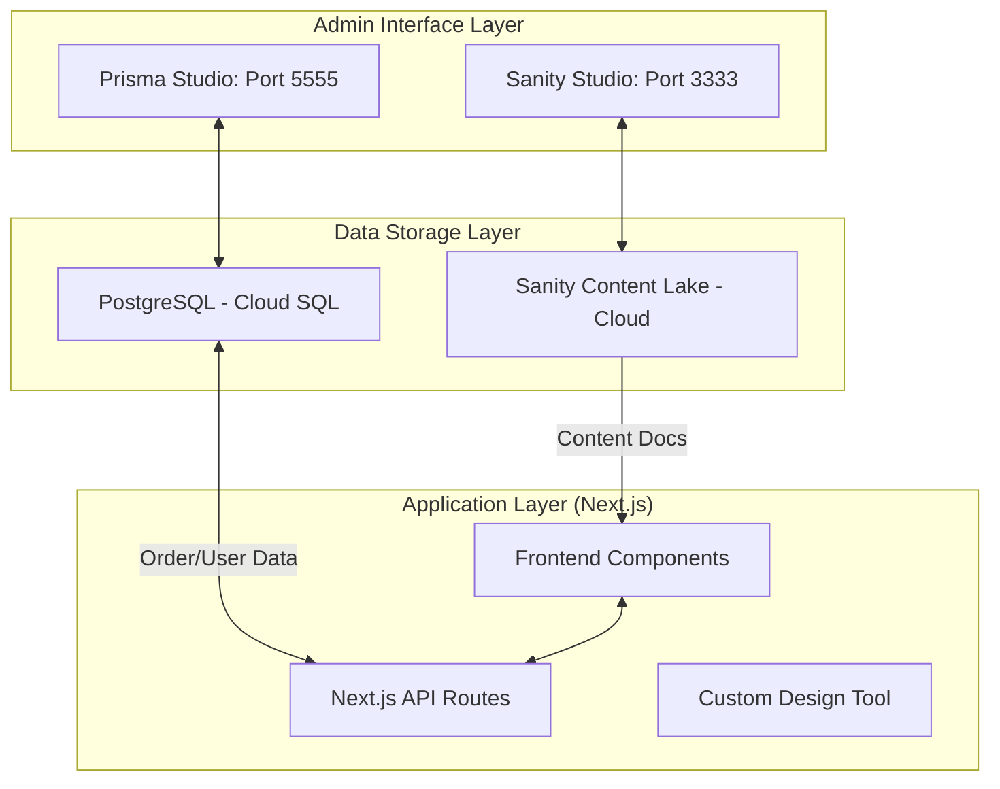

*Gemini 3 Flash*

# 🏗️ STUDIO_4.md: The Unified Commerce Architecture Specification

> **Sampada E-Commerce Platform**  
> **Prepared for:** Antigravity / Antigravity Team  
> **Date:** January 17, 2026  
> **Version:** 4.0 (Enterprise Ready)

---

## 🏛️ 1. High-Level Architecture Overview

Sampada operates on a **Decoupled Strategic Hybrid** model. We distinguish between **Marketing Content** (Sanity) and **Business Logic/Transactions** (Prisma).

### The Synergy Model

---

## 🗃️ 2. Prisma Studio: The Transactional Core

### **What is Prisma Studio?**
Prisma Studio is a visual database browser for your PostgreSQL instance. While Sanity is "What you see" on the marketing pages, Prisma is "What you do" in terms of logic.

### **Features & Use Cases**
- **Data Integrity:** Strict schema enforcement via `schema.prisma`.
- **Relational View:** See exactly which `CustomDesign` belongs to which `DesignUser`.
- **Transaction Logs:** Track `CustomOrder` statuses (Pending, Paid, Shipped).

### **Sampada Benefits**
1.  **Tier Management (Screenshot 5):** Manually override a user's `designerTier` if they upgrade via a custom invoice.
2.  **Design Debugging:** View the `canvasData` JSON directly to troubleshoot complex t-shirt layouts.
3.  **Fulfillment:** Pull CSV exports of orders for Printify or local artisans.

### **How to Access (localhost:5555)**
1.  Navigate to `E:\Agentic AIs\Groq_ChainMorph\abscommerce\abscommerce`.
2.  Run `npx prisma studio`.
3.  Browse the `DesignUser`, `CustomDesign`, and `CustomOrder` tables.

---

## 🎨 3. Sanity Studio: The Content Experience

### **Current Setup (localhost:3333)**
Managed in `sanity_abscommerce`. Powering the "Winter Drop 2026" (Screenshot 4) and the "Sampada Stories" hub.

### **E-Commerce Modeling Strategy**
- **Product-First:** Each product (e.g., "Bohemian Tunic", Screenshot 3) is a document with references to categories and high-res image assets.
- **Dynamic Banners:** Banners are editable docs, allowing marketing to change captions like "Wear Your Legacy" without code deploys.

### **The "Story" Workflow**
1.  **Compose:** Author writes a post in Sanity using the Portable Text editor.
2.  **Preview:** Next.js fetches data via GROQ.
3.  **Deploy:** The post appears instantly on the `/stories` page.

---

## 🔌 4. Top 5 Essential Sanity Plugins for Sampada

Based on **Plugin Images (1-2)** and **Store UI (3-4)**:

| Plugin Name | Purpose | Use Case for Sampada |
| :--- | :--- | :--- |
| **Sanity Hero Block** | Block-based Hero Editor | Controls the "Winter Drop" homepage banner layouts exactly as shown in Screenshot 4. |
| **Amazon Product Sync** | Cross-platform catalog | Syncs your unique ethnic wear to Amazon Marketplace automatically. |
| **Color Input** | Visual Color Picker | Manages the "Dusty Rose" and "Coral" swatches for the Tunic variant selection (Screenshot 3). |
| **Media Library** | Grid-based asset manager | Organizes the hundreds of product variant photos and artisan videos. |
| **SEO Pane** | Search previews | Visualizes how your "Cultural T-Shirt Designer" appears on Google search results. |

---

## 🔗 5. Unified Studio Integration Strategy

### **The Critical Answer: Can we merge them?**
We do not merge the *code*, we merge the *experience*.

1.  **Shared Identity:** The `CustomOrder` in Prisma stores the Sanity `_id` of the product purchased.
2.  **Unified Dashboard:** Create a custom Sanity Dashboard widget that fetches "Recent Sales" from the Prisma API.
3.  **Workflow Logic:** 
    - **Edit Content?** -> Sanity Studio.
    - **Refund Order?** -> Prisma Studio.

---

## 🚀 6. Surprise Element: "AI Personalized Style Engine"

### **The Innovation**
Using **Google AI / Gemini Pro (Screenshot 7)** integration:

**The Feature:** 
An AI service that analyzes the **Sanity Product Description** (e.g., "Hand-embroidered cultural motif") and cross-references it with the **Prisma User History** (e.g., "Previous purchases of high-neck tops").

**Automation Potential:**
- Gemini generates a **"Why we picked this for you"** text block for every user on the homepage.
- **Integration:** The AI reads from Sanity (Content) and Prisma (User behavior) to create a truly bespoke shopping experience.

---

## 🛠️ 7. Troubleshooting & Scale

- **Build Failures:** Current fix is `npx next build --no-lint` to bypass React 19 / Sanity v3 dependency conflicts.
- **Data Mismatch:** Ensure `sanityProductId` in Prisma always maps to a valid document in Sanity.
- **Future Scale:** Move from Localhost to **Google Cloud Run (Screenshot 5)** as the user base grows.

---

**Certified by:** Antigravity AI  
**Next Steps:** Proceed to `npm install` for Hero Block and Color Input plugins.
